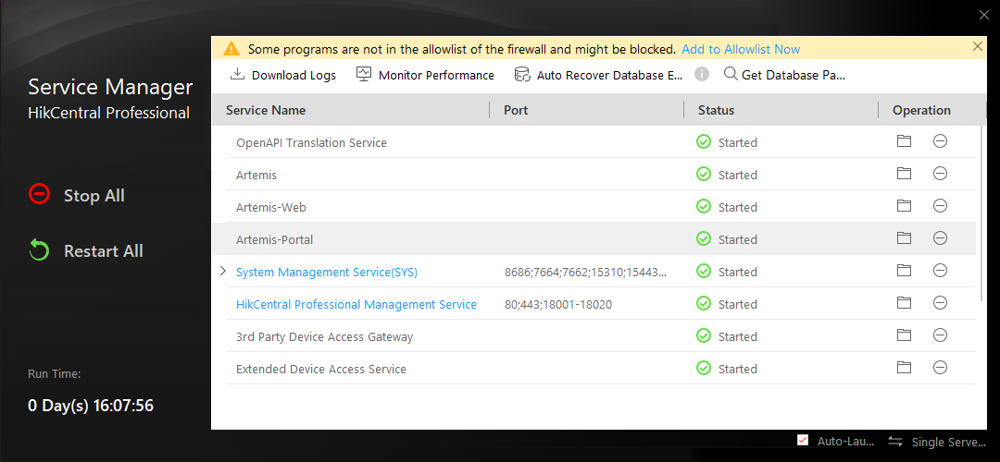
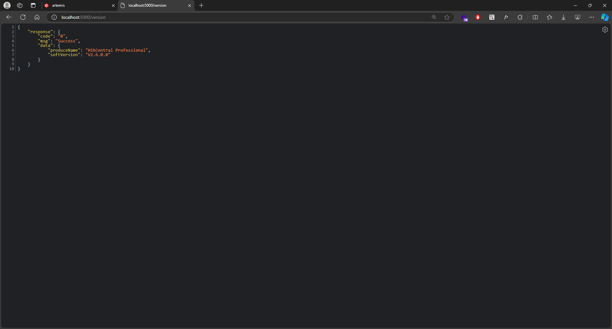
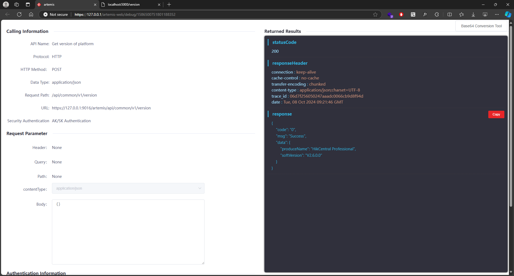
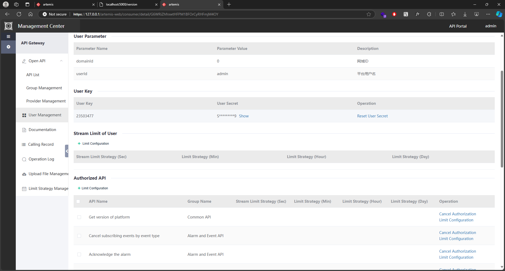

# Node.js HikCentral Professional Open-API Wrapper
A Node.js connector to consume a data from HikCentral Pro OpenAPI.

This express app generated using `npx express-generator` and removed views part.

Its only want it to work as a fetcher.

## Key Takeaways
To show on how to manage signature calculation.

```javascript
function getSignature(apiPath) {
   const stringToSign = `POST
*/*
application/json
x-ca-key:${HIKVISION_APP_KEY}
${apiPath}`;
   
   // appLogger.info('stringToSign - ' + stringToSign);
   console.info('stringToSign - ' + stringToSign);
   
   // Create an HMAC object using SHA256 and the secret key
   const hmac = crypto.createHmac('sha256', HIKVISION_APP_SECRET);
   
   // Update the HMAC object with the data to sign
   hmac.update(stringToSign, 'utf8');
   
   // Calculate the HMAC digest and encode it in Base64
   const signed = hmac.digest('base64');
   console.info('signed - ' + signed);

   return signed;
}
```

## Prerequisites
1. Make sure to install HikCentral Pro with OpenAPI.
2. Make sure all HikCentral Pro up and running.
3. Assuming you have already followed as per HikCentral documentation setup until you can access their Artemis online debug tools. 
To play around with their Open API.

## Testing
To test it is running properly:

- Open Browser and navigate to `http://localhost:5000`.
- Open Browser and navigate to `http://localhost:5000/version`.

## Screenshots
<!-- 


 -->


